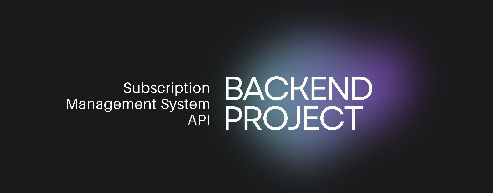

<div align="center">
  <br />
    <a href="https://github.com/SreejithMVarma/subscription-tracker" target="_blank">
      
    </a>
  <br />
  <h3 align="center">Subscription Management System API</h3>
</div>

## 📌 Introduction

A simple backend project for managing subscriptions with user authentication, database integration, and automated email reminders. Built using Node.js, Express.js, and MongoDB.

## ⚙️ Tech Stack

  <div>
   -  
    </div>
    <div>
   - 
    </div>
    <div>
   - 
    </div>

## 🔥 Features

- User authentication with JWT
- Subscription tracking and management
- Rate limiting and bot protection
- Email reminders for due payments
- Global error handling and logging

## 🚀 Quick Start

### Prerequisites

Ensure you have the following installed:

- [Git](https://git-scm.com/)
- [Node.js](https://nodejs.org/en)
- [npm](https://www.npmjs.com/)

### Installation

```bash
# Clone the repository
git clone https://github.com/SreejithMVarma/subscription-tracker.git
cd subscription-tracker

# Install dependencies
npm install
```

### Set Up Environment Variables

Create a `.env.local` file and add:

```env
PORT=5500
NODE_ENV=development
SERVER_URL="http://localhost:5500"

DB_URI=
JWT_SECRET=
JWT_EXPIRES_IN="1d"

ARCJET_ENV=development
ARCJET_KEY=

QSTASH_URL=http://127.0.0.1:8080
QSTASH_TOKEN=

EMAIL_PASSWORD=
```

### Run the Project

```bash
npm run dev
```

Access [http://localhost:5500](http://localhost:5500) in your browser or API client.

## 📝 Example JSON Data

```json
{
  "name": "Target FAANG",
  "price": 101.00,
  "currency": "INR",
  "frequency": "monthly",
  "category": "lifestyle",
  "startDate": "2025-02-05T00:00:00.000Z",
  "paymentMethod": "Credit Card"
}
```

## 📌 Useful Links

- **Arcjet** - [Launch Arcjet](https://arcjet.com/)  
- **Upstash** - [Upstash](https://upstash.com/)  
 

Enjoy experimenting and feel free to improve upon it!

